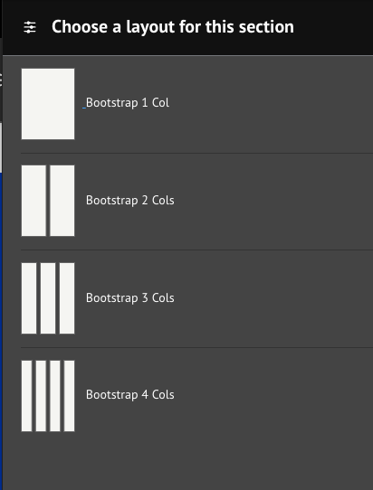
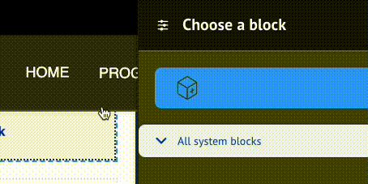
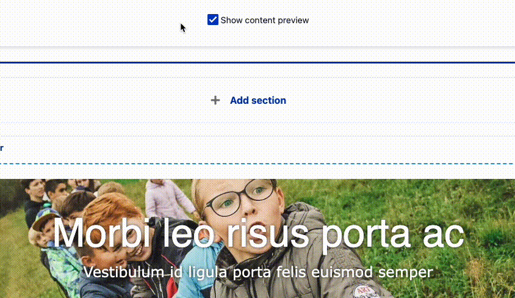

Layout Builder is a powerful new page-building addition to your YMCA website.

> Drupal's Layout Builder allows content editors and site builders to easily and quickly create visual layouts for displaying content. Users can customize how content is arranged on a single page, across types of content, or even create custom landing pages with an easy-to-use drag-and-drop interface.

## Getting Started with Layout Builder

YMCA Website Services 9.2.12 introduces a new Content Type: **Landing Page (Layout Builder)**. This new page will allow you to utilize "Custom Blocks" in "Sections" with different "Layouts" to build pages. Please contact your development partner if you need assistance updating the latest version.

### Creating a new page

To use Layout Builder, you'll first have to create a new page:

- Go to **Content** > **Add Content** > **Landing Page (Layout Builder)**.

This creation page will look different than others—there are no fields!

- Set a page **Title** and configure any **Menu settings** or **URL alias** that you'd like.
- Ensure that **Published** is unchecked.
- Then **Save** the page.

Once you've saved, you will see an empty page. Click the **Layout** tab to enter Layout Builder.

### Updating an existing page

Navigate to the page you'd like to update, then click the **Layout** tab, like above.

Once you are in the Layout editor, you can create, edit, rearrange, and delete sections and blocks while viewing the page in a what-you-see-is-what-you-get preview mode.

### Saving and publishing

Changes to the page are not displayed to site viewers until you **Save Layout** on the page and **Publish** it.

When in the **Layout** editor, you will have these options at the top of the page:

- **Save Layout**
- **Discard Changes**
- **Revert to Defaults** will reset your page to an empty Header and Body section.

After saving your changes, be sure your page is published:

- Click the **Edit** tab.
- Check **Published**.
- **Save** the page.

## Fundamentals

In Layout Builder, you will see the page divided up into Sections and Blocks. Your page may already be populated with a **Header** and **Body** section to get you started building, and you can change or edit those to fit your page.

### Sections

Sections create the structure of the page and contain blocks. You can drag and drop blocks between sections, but you cannot move sections themselves—you can only create sections above or below existing sections.

You can remove sections by clicking the small "X" link at the top left of the section. Click on "Configure <Name of Section>" to edit the section layout and other options.

#### Layouts

Layouts define the structure of a section. YMCA Website Services comes with 1-, 2-, 3-, and 4-column layouts, and each layout has additional configuration options once it's created. See [advanced options]() for more details.

Some options in this configuration may not yet be fully supported.

### Blocks

While **Sections** contain the page's **structure**, **Blocks** contain its **content**.

To create a block, click Add Block in any section of the page, then Create Custom Block.

Your YMCA website has a wide array of blocks to choose from. In this section, you will find detailed descriptions of those blocks.

## Tips and Tricks

### Get more space for writing

The Content Editing Pane—the sidebar where you edit blocks —can sometimes be too small to get all of your content in there nicely. Simply drag anywhere on its left border to expand the pane.

### Rearrange blocks easily

When rearranging large blocks on the page it can often be challenging to drag them around. To make this easier, uncheck **Show content preview** at the top of the page. This will substitute the "WYSIWYG" preview for block titles, making the content much more compact.

---

If you run into a problem, [get in touch](../../../community).

<small>Content on this page is adapted from [Drupal.org](https://www.drupal.org/docs/8/core/modules/layout-builder) and [Western Washington University](https://brand.wwu.edu/layout-builder)</small>